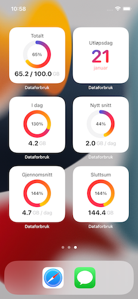
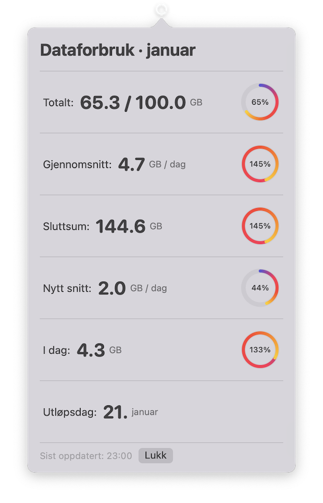
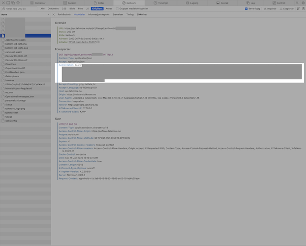

# Dataforbruk

Sjå status over mobildataforbruk med Talkmore. App for iOS + widgets, status bar app til macOS. Denne appen syner diverse statistikk over eigen mobilbruk.

Tilgjengeleg statistikk er:

- Totalt — kor mykje av tilgjengeleg data som er brukt opp
- Gjennomsnitt — kor mykje data du har brukt per dag i snitt
- Sluttsum — kor mykje data du kjem til å bruke ila. månaden med same snittbruk
- Nytt snitt — kor mykje du kan redusere/auke bruken din med for å bruke opp inkludert data
- I dag — kor mykje data du har brukt i dag
- Utløpsdag — Dato for oppbrukt data (OBS: er ikkje begrensa, kan bli meir enn 31…)

    
    
    

## Kom i gang

- Last ned prosjektet og åpne i Xcode
- Endre *Team* i *Signing & Certificates*
- Opprett fila `Config.plist` i gruppa `Common` og vel alle targets.
  - Legg inn feltet `Nummer` av typen `String` med verdien av ditt nummer
  - Legg inn feltet `Token` av typen `String` med verdien av [accesstokenet frå Talkmore](#skaff-token-frå-talkmore)
- Build & run

## Skaff token frå Talkmore

Har ikkje fått til innlogging med brukarnamn og passord. Ein må difor nytte eit token frå Talkmore direkte for å køyre API-kall. Tokenet er av typen JWT og er gyldig i **50 dagar (4.32E+6 sekund)**.
Tokenet må setjast inn i `Token`-feltet i `Common/Config.plist`.

Tokenet kan skaffast slik:

- Gå til [Mine sider](https://talkmore.no/login)
- Opne nettinspektøren (Cmd+I i Safari), gå til `Nettverk` og `XHR/Fetch`
- Logg inn og vent til sida lastar
- Trykk på fila som har ditt nummer på seg, tokenet er `Authorization: Bearer <Token>` under `Forespørsel`. (Vanlegvis begynnar tokenet med “ey”)

